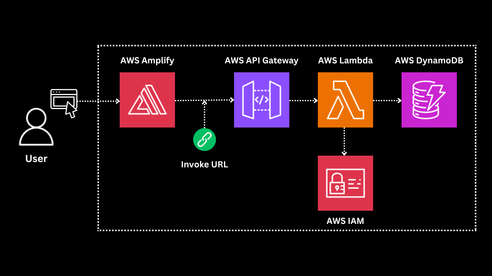

# Math Web Application using AWS Services

## Overview
This project demonstrates how to build a simple web application using AWS services. The application performs basic math operations and stores results in a database.

## AWS Services Used
- **AWS Amplify** – Hosting the frontend
- **AWS Lambda** – Backend logic for math operations
- **AWS IAM** – Managing permissions
- **Amazon API Gateway** – Exposing Lambda as a REST API
- **Amazon DynamoDB** – Storing computed results

## Architecture
Below is the architecture diagram of the project:

## Prerequisites
- An AWS account
- AWS CLI installed and configured
- Basic knowledge of HTML, JavaScript, and Python

## Project Setup

### 1. Create and Deploy Frontend
1. Create an `index.html` file.
2. Deploy it using AWS Amplify.

### 2. Set Up Backend
1. Create an AWS Lambda function in Python for math operations.
2. Test the Lambda function.

### 3. Configure API Gateway
1. Create a REST API in API Gateway.
2. Link the API to the Lambda function.

### 4. Store Results in DynamoDB
1. Create a DynamoDB table.
2. Update the Lambda function to store results.

### 5. Deploy and Test
1. Update `index.html` to call API Gateway.
2. Deploy changes using Amplify.
3. Test the complete application.
